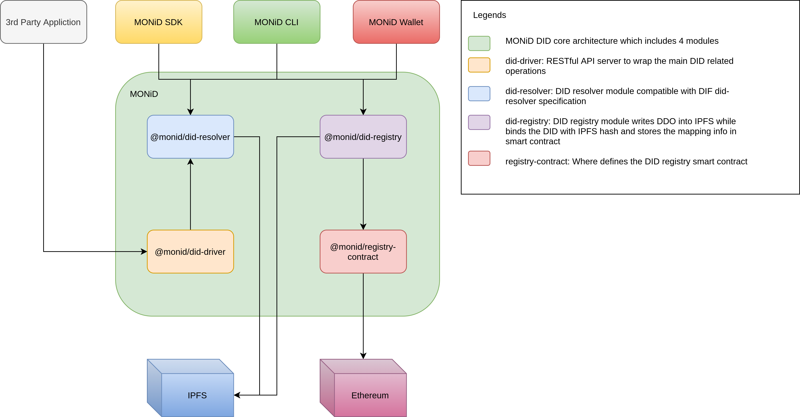

# MONiD DID Method Specification

[LianXi-Tech](https://lianxi-tech.com), Dec/03/2020, V1

## Abstract

The MONiD DID method aims to implement Decentralized Identifier [did-core](https://www.w3.org/TR/did-core/) architecture in a secure, robust and flexible way. It's core technologies are bulit on Ethereum blockchain and the Interplanetary File System (IPFS).

## Overview

The MONiD DID method uses IPFS as a decentralized data storage for DID Documents. The DID Document format is like:

```js
{
  '@context': 'https://w3id.org/did/v1',
  id: 'did:monid:1fb352353ff51248c5104b407f9c04c3666627fcf5a167d693c9fc84b75964e2',
  publicKey: [
    {
      id: `did:monid:1fb352353ff51248c5104b407f9c04c3666627fcf5a167d693c9fc84b75964e2#keys-1`,
      controller: 'did:monid:1fb352353ff51248c5104b407f9c04c3666627fcf5a167d693c9fc84b75964e2',
      publicKeyHex: '0298a5f231fc9224ca466bdbd0b27cb34d27939d0e8aa4b65ba4ef1ed805f14975',
      type: 'Secp256k1VerificationKey2018',
    },
  ],
  service: [
    {
      id: `did:monid:1fb352353ff51248c5104b407f9c04c3666627fcf5a167d693c9fc84b75964e2`,
      type: 'MONiDPublicProfile',
      serviceEndpoint: 'https://ipfs.monid.io/QmdBfKM9YQrtX5V4FvYhEVju8VsVE5488ufcJ9rWWgD892',
    },
  ],
}
```

On the Ethereum side, a [smart contract](https://github.com/lianxi-tech/monid/blob/master/packages/monid-registry-contract/contracts/Registry.sol) provides a mapping from a DID to an IPFS hash address of the corrosponding DID Document. Given a DID, MONiD did resolver module can the retrieve the DDO data from IPFS.

## Architecture



### @monid/did-driver

RESTful API server to wrap the main DID operations

### @monid/did-resolver

DID resolver module compatible with DIF [did-resolver](https://github.com/decentralized-identity/did-resolver) specification

### @monid/did-registry

DID registry module writes DDO into IPFS while binds the DID with IPFS hash and stores the mapping info

### @monid/registry-contract

Wrapper for deploying / interacting with an instance of the Monid registry Ethereum smart contract
